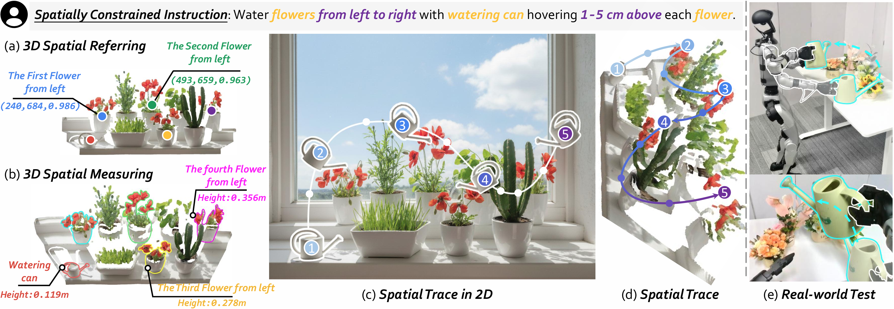

<h1 align="center">RoboTracer: Mastering Spatial Trace with Reasoning in Vision-Language Models for Robotics</h1>

<h3 align="center">From what you say to where it moves — with RoboTracer</h3>


<p align="center">
  <a href="#"></a>
  &nbsp;
  <a href="https://zhoues.github.io/RoboTracer/"></a>
  &nbsp;
  <a href="#"></a>
  &nbsp;
  <a href="#"></a>
</p>


<div style="text-align: center; background-color: white;">
    
</div>


## 🔥 Updates
[2025-12-16] 🔥🔥🔥 We release RoboTracer on [arxiv](https://arxiv.org/abs/2512.13660) and launch the [project page](https://zhoues.github.io/RoboTracer/). It retains all [RoboRefer](https://github.com/zhoues/RoboRefer) (previous version) features while also further supporting multi-step, metric-grounded spatial tracing with explicit reasoning. 


## 🕶️Overview

### The Overview of RoboTracer

We introduce RoboTracer, **the first 3D-aware reasoning VLM** for multi-step metric-grounded spatial tracing with explicit reasoning.

<div align="center"> 
    
</div>


### The Overview of the TraceSpatial Dataset and its Generation Pipeline

We present TraceSpatial, a dataset can enable general VLMs to adapt to spatial tracing tasks, with **4.5M data samples (~30M QA pairs)** from 2D/3D/Video sources, spanning **outdoor/indoor/tabletop scenes** and containing **complex reasoning processes (up to 9 steps)**.


<div align="center"> 
    
</div>


## TODO
- [ ] Release TraceSpatial-Bench evaluation code (About 2 week).
- [ ] Release the SFT-trained 2B RoboTracer model and inference code (About 1 month).
- [ ] Release the SFT-trained 8B RoboTracer model (About 2 months).
- [ ] Release the TraceSpatial Dataset and SFT training code (About 2 months).
- [ ] Release the RFT-trained RoboTracer model and training code (Maybe 2 months or more).
- [ ] Release the Dataset Generation Pipeline (Maybe 2 months or more).


## Contact
If you have any questions about the code or the paper, feel free to email Enshen (`zhouenshen@buaa.edu.cn`) Yibo (`leeibo@buaa.edu.cn`), and Jingkun (`anjingkun02@gmail.com`). 


## Acknowledgment
- This repository is built upon the codebase of [NVILA](https://github.com/NVlabs/VILA), [RoboRefer](https://github.com/zhoues/RoboRefer), [MapAnything](https://github.com/facebookresearch/map-anything), [R1-V](https://github.com/Deep-Agent/R1-V).

- We acknowledge [OpenImage](https://storage.googleapis.com/openimages/web/index.html), [CA-1M](https://github.com/apple/ml-cubifyanything), [ScanNet](http://www.scan-net.org), [DROID](https://droid-dataset.github.io/), [AgiBot-Beta](https://huggingface.co/datasets/agibot-world/AgiBotWorld-Beta), [RoboTwin 2.0](https://github.com/robotwin-Platform/robotwin) for their data and assets.


## 📑 Citation

If you find RoboTracer, TraceSpatial, and TraceSpatial-Bench useful for your research, please cite using this BibTeX:
```
@article{zhou2025robotracer,
    title={RoboTracer: Mastering Spatial Trace with Reasoning in Vision-Language Models for Robotics},
    author={Zhou, Enshen and Chi, Cheng and Li, Yibo and An, Jingkun and Zhang, Jiayuan and Rong, Shanyu and Han, Yi and Ji, Yuheng and Liu, Mengzhen and Wang, Pengwei and others},
    journal={arXiv preprint arXiv:2512.13660},
    year={2025}
}
```
